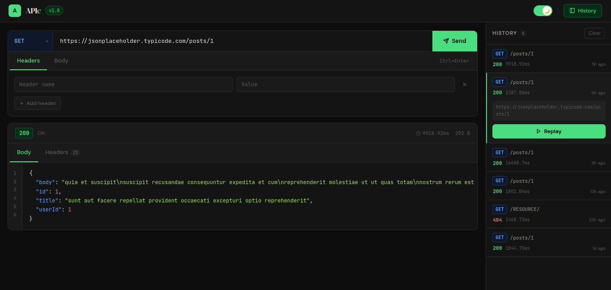

<h1 align="center">
  APIc 🚀
</h1>

<p align="center">
  <strong>A lightweight, modern API client for testing and debugging REST APIs.</strong>
</p>

<p align="center">
Built with React, Flask, and SQLite.
</p>

<p align="center">
  
  
  
  
</p>

---

# 📸 Preview


<p align="center">

</p>

---
## 🌐 Live Demo

🔗 **Live Application:** https://apic-chi.vercel.app

Open the application in your browser and start testing REST APIs instantly—no installation required.

# ✨ Features

- 🚀 Send HTTP requests (GET, POST, PUT, PATCH, DELETE)
- 📝 JSON request body support
- 🏷 Custom request headers
- 📜 Request history
- ⚡ Fast response rendering
- 🎨 Modern responsive UI
- 🌙 Dark mode interface
- 💾 SQLite-backed history storage

---

# 🛠 Tech Stack

### Frontend

- React
- Vite
- CSS

### Backend

- Flask
- Flask-CORS

### Database

- SQLite

---

# 🚀 Getting Started

## Clone

```bash
git clone https://github.com/Burhanuddinsiddikwala/APIc.git
```

## Frontend

```bash
cd frontend
npm install
npm run dev
```

## Backend

```bash
cd backend
pip install -r requirements.txt
python app.py
```

---

# 📖 Usage

1. Select an HTTP method.
2. Enter an API endpoint.
3. Add optional headers.
4. Add a JSON request body (for POST/PUT/PATCH).
5. Click **Send**.
6. View the formatted response and request history.

---

# 📂 Project Structure

```
APIc
│
├── frontend/
│
├── backend/
│
├── screenshots/
│
├── docs/
│
└── README.md
```

---

# 🎯 Roadmap

- [ ] Authentication support
- [ ] Environment variables
- [ ] Collections
- [ ] Import/Export requests
- [ ] GraphQL support
- [ ] WebSocket testing
- [ ] Response filtering
- [ ] Code generation (cURL, Python, JavaScript)

---

# 🤝 Contributing

Contributions, issues, and feature requests are welcome.

Feel free to fork the repository and submit a Pull Request.

---

# 📄 License

This project is licensed under the MIT License.

---

## ⭐ Support

If you found this project useful, consider giving it a ⭐ on GitHub.

It helps the project reach more developers.
